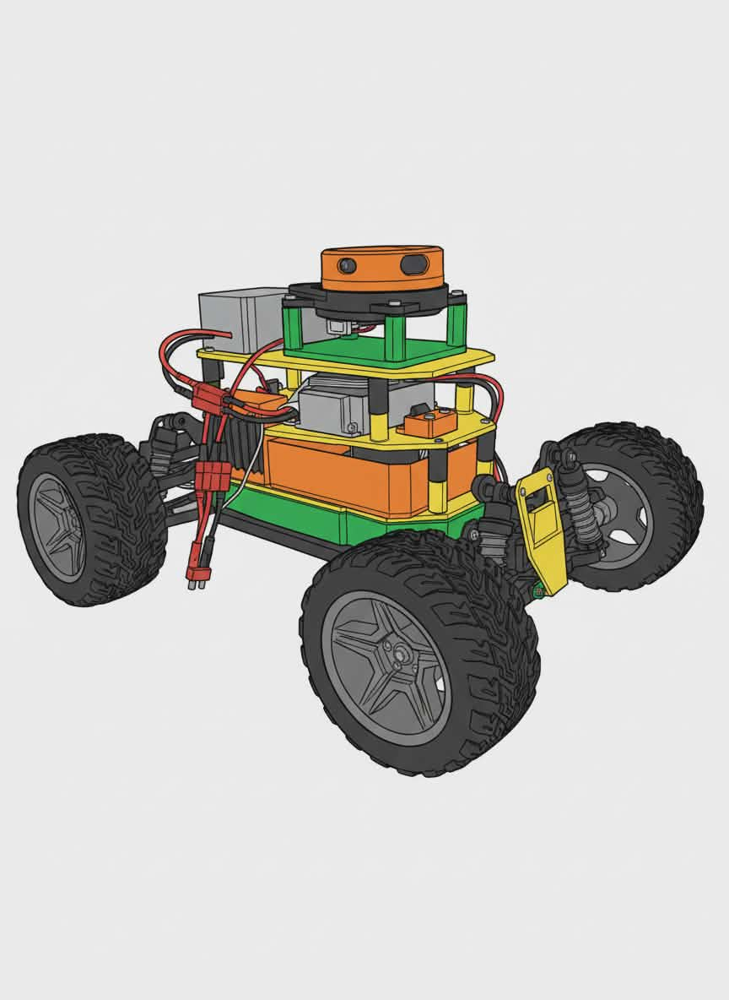

# Mobile Autonomous Robot with lidar and camera for collision avoidance

This project's aim is to develop autonomous navigation system. Current robot is built on a modified RC car, serving as a protype, for larger and designed from scratch platform.

Key Features:
* ROS2 - Robot Operating System 2 as workspace
* Real time object detection algorithm for detecting obstacles 
* Lidar and Camera fusion to calculate precise distances to detected objects
* Custom 3D printed components
* Distributed jobs between Nvidia Jeton Nano (Object detection) and ESP32 (Motor/Servo Control)
* Machine Learning model was trained on open source dataset, which is currently expanded with images collected by our team

## Sensor Fusion
Our camera Lidar Fusion algorithm is modified version of :
[CDonosoK lidar camera fusion ](https://github.com/CDonosoK/ros2_camera_lidar_fusion/tree/main)

Modification includes changing algorithm for 2D lidar applicability, changes in coordinate systesms and fusion with Ml algorithm

## Hardware:
Controllers and Sensors:
* Nvidia Jetson Nano for object 
* ESP 32 for engines and servo steering
* slamtec rplidar A3M1
* raspberry pi camera V2.1
* Gyroscope MPU 6050

Actuation:
* Servo motor for directional control
* Electric engine 

# 

